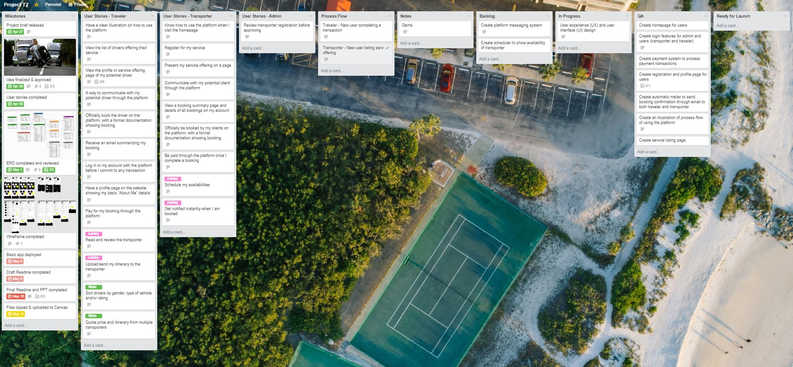
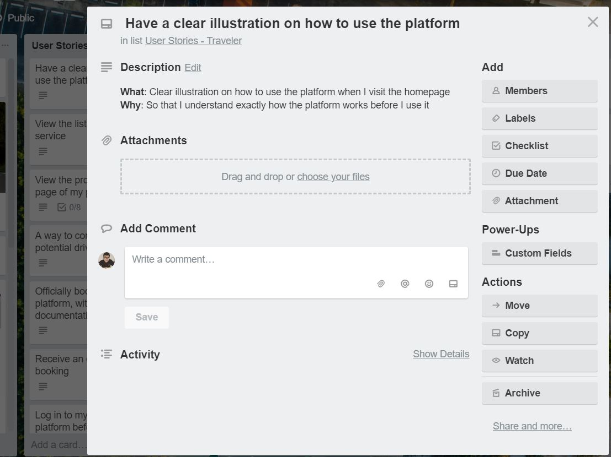
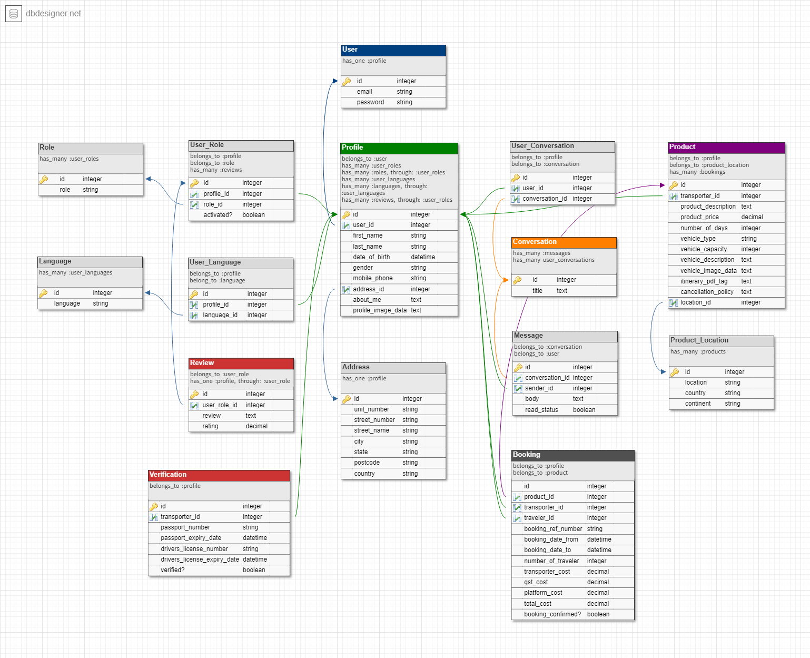
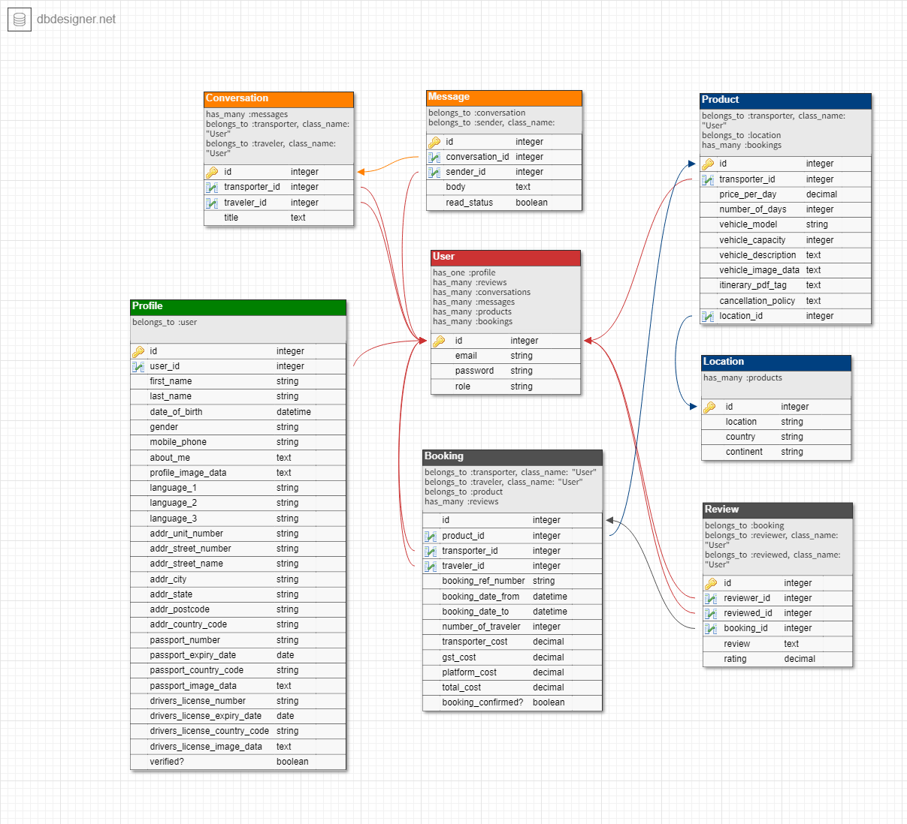
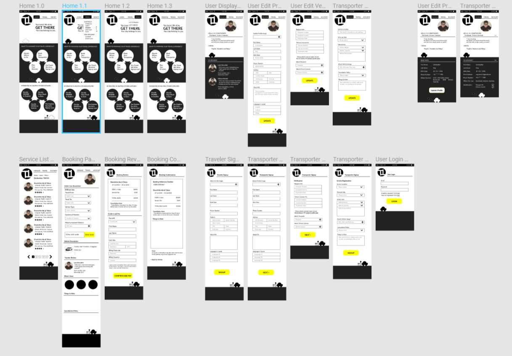
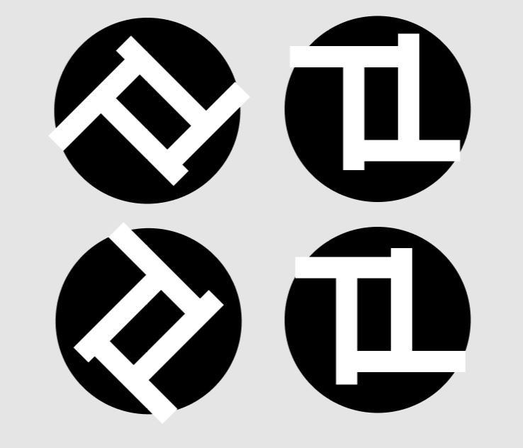

See [link](https://desolate-plateau-51220.herokuapp.com/) to web application.

## **Table of Contents**

- About Project
    - Problem
    - Solution
- Planning
    - Trello
    - Audience
    - User Stories
        - Travelers
        - Transporters
    - Entity Relationship Diagram (ERD)
- Design
    - Wireframes
- Development
    - Requirements
    - Technologies
    - APIs
    - Gems
- Challenges and Final Thoughts
- Future Developments

## **About Project**
The project aims to design, build, deploy and present a Ruby on Rails application. The web app must be a two sided marketplace that connects two parties exchanging goods or services.

### **Problem**
#### **Some observations**:
- People are more inclined to plan their own trip when travelling abroad - the desire for *personalised travel experience*
- People seem to value *experiences* more when they are traveling

#### **Insights**
According to a [report](https://www.trekksoft.com/en/library/) by TrekkSoft, the top travel experiences for 2018 based on user surveys are:
- Recharging Deep in Nature
- `The One-off Experience You Can't Get Elsewhere`
- A Walking Tour in a Cultural Capital
- Sustainable Adventure Travel
- `Slightly Crazy Story to Take Home`
- `Really Getting to Know a Country and Its Culture`
- Thrills in a Stunning Location

#### **What are Some Pain Points in Traveling?**
- `Transportation planning` might be difficult without proper understanding of the local transportation infrastructure.
    > Who would know best if not the locals?
- `Language barrier` when travelling to a country speaking foreign language
- The well-advertised food and shopping destinations online are mostly places "catered" for tourists. Downsides include extra markup to capitalize on the ignorance of travellers from abroad and inability to truly experience the local experience.
    > What if someone `local help` with research and recommendations based on their understanding of their culture?

### **Proposed Solution**
- A platform connecting local drivers or host with travellers
    - For `travellers`, this will be a solution to their help smooth up their travel experiences as they do not have to worry about "How do we get there?"
    - For `local drivers`, this will be an opportunity for them to earn some income while also exploring locally themselves.

### **Planning**

[Trello](https://trello.com/b/E9L5EBF7/project-t2) was used as the main project planning platform:

Trello is a "kanban" style tool that allows users to track action items throughtout the project. Main boards used during project development were:
- Milestones
- User Stories
- Backlog
- Backlog
- In Progress
- Quality Review
- Ready for Launch

Each user story is linked to a feature which then gets breakdown into tasks to execute the generation of the feature. Each set of task is tracked with a checklist. Hence, by completing the whole set of task, the feature is then built. The process repeats until all features required for the minimum viable product (MVP) is completed.

#### **User Stories**
See link to Trello board for full sets of user stories: https://trello.com/b/E9L5EBF7/project-t2

Basically, users are separated into two broad groups:
- Traveller
- Transporter

For each user story, the "what" and "so that" is defined as such:

After drafting the user stories, I moved on to develop the ERD for the web application. This is a very important exercise to really help understand how information flows within the web app.

**Version 1**

**Version 4**

The final version was much simpler as I start to consolidate the features required for the web app and understanding what can be accomplished within the given timeframe for the purposes of a minimum viable product.

### **Design**

The initial plan was to simplify the design of the app due to time constraint and for the purposes of a MVP. 

- A simple black and white + one **color** option was selected for the design of the web app. 

- The **font** selection was also pretty quick. The app requires a modern and simple interface, hence I decided on the sans-serif option - "Lato" was selected as the font option for the web app

- The design was done with the mobile-first principle and using the responsive nature of modern CSS, scale to the desktop version.

- The logo was inspired the relationship between the two main users of the web application - travellers and transporters. Hence, T2 was selected as the name of the platform. The logo is designed as a combination of two Ts.

### ** Development**

Requirements:
- Create the web application using Ruby on Rails.
- Demonstrate knowledge of Rails conventions.
- Use postgresql database in development.
- Use an API (e.g. Omniauth, Geocoding, Maps, etc).
- Use appropriate gems.
- Use environmental variables to protect API keys etc. (dotenv)
- Implement a payment system for the product. (e.g. Stripe)
- The web app must send transactional emails (eg. using Mailgun).
- The web app will have some type of searching, sorting and/or filtering capability.
- The app will have some type of file uploading capability (eg. images).
- The app will have authentication (eg. Devise, must have full functionality in place).
- The app will have authorisation (users have restrictions on what they can see and edit).

The structuring of the web application follow the `CRUD principles` to create a RESTful web application.
- Each feature typically composed of a Create, Read, Update and Destroy (CRUD) framework. For example, the User authentication-related features consists of user registration (create), user information display in a profile page etc (read), user information update i.e. update email address or password (update) and closing of the user account (destroy)
- Once the CRUD model for each feature is determined, the routes are then designed to execute the CRUD model.
- Controllers and models are generated to perform the CRUD functions

### **Challenges and Final Thoughts**

Challenges:
- Web app development `execution plan` - I struggled to visualize the processes/steps required to build a feature from 1 to 10. Due to limited experience, there were many mis-steps and repeats.
    > There are really only two ways to learn - one from other people mistakes or from my own mistakes

- Understanding of the concept of Rails - Rails is a "framework", a way of doing things. Actual building a web app from scratch helps to truly understand why Rails were developed a certain way. I feel like I am just scratching the surface, more to learn.

- Problem solving - there were a lot of problems faced during the project - mentally, physically and psychologically. The ability to solve problems is limited by the resource factor (time and energy). Prioritizing becomes important - what are the most urgent and important problems that need to be solved first?

- Realization that the web app development community that we have access to is the whole world's resources. It is a big ocean not a small pond. Such access allows knowledge to flow more freely. Competitions are more challenging which help spurs growth faster than any other field in the industry.

Some technical issues still to be solved:
- User authetication (Pundit) and model validations
- Devise soft-destroy functionality

### **Future Development**

- Design and Layout
- Admin-side functionality
    - Admin dashboard
    - Admin workflow and user interactions
- Ratings and reviews
- Messaging
- Transporter scheduling
- Transporter variable rates by day